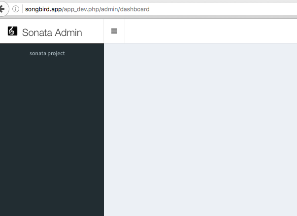

# Chapter 9: The Admin Panel Part 1

We have used FOSUserBundle to create a User CRUD in the previous chapters. It's looking ugly at the moment but its functional. However, anyone can access the user management if they have the right url. We need an admin area where administrators can login and manage the users. All administrative activities should happen behind the admin url, something along the lines of /admin/users for example.

Again, we will try to simplify the process by reusing a 3rd party module that others have created. [EasyAdmin](https://github.com/javiereguiluz/EasyAdminBundle) and [SonataAdmin](https://github.com/sonata-project/SonataAdminBundle) are quite popular at the moment. In this book we will be using the later to build the admin panel. Before we start building it, we should ask ourselves an even ambitious question "Wouldn't it be nice if someone could combine the FOSUserBundle and SonataAdmin into one bundle and we could just install that single bundle?". As you would expect, this has been done and this bundle is called [SonataUserBundle](https://github.com/sonata-project/SonataUserBundle).

It wouldn't be fun if we just use the ready made solution. In this and the next few chapters, we will attempt to integrate FOSUserBundle and SonataBundle.

## Objectives

> * Install SonataAdminBundle
> * Integrate FOSUserBundle and SonataAdminBundle
> * Filtering the User fields
> * Redirecting Users to Dashboard After Login
> * User Roles and Security
> * Cleaning Up

## Pre-setup

Make sure we are in the right branch. Let us branch off from the previous chapter.

```
# check your branch
-> git status
# start branching now
-> git checkout -b my_chapter9
```

## Install SonataAdminBundle

As usual, let us add the required bundles in the composer.json file

```
# composer.json

"require": }
    ....
    "sonata-project/admin-bundle": "^3.4",
    "sonata-project/doctrine-orm-admin-bundle": "^3.0"
    ....
```

then run composer update

```
-> composer update
```

and remember to activate the required bundles in AppKernel.php

```
# app/AppKernel.php
...
// Sonata Admin dependencies
new Sonata\CoreBundle\SonataCoreBundle(),
new Sonata\BlockBundle\SonataBlockBundle(),
new Knp\Bundle\MenuBundle\KnpMenuBundle(),
new Sonata\DoctrineORMAdminBundle\SonataDoctrineORMAdminBundle(),
new Sonata\AdminBundle\SonataAdminBundle(),
...
```

Update the config file with new parameters.

```
# app/config/config.yml
...
#sonata block
sonata_block:
    default_contexts: [cms]
    blocks:
        # Enable the SonataAdminBundle block
        sonata.admin.block.admin_list:
            contexts:   [admin]
```

and routing file

```
# app/config/routing.yml
...
# sonata admin
admin:
    resource: '@SonataAdminBundle/Resources/config/routing/sonata_admin.xml'
    prefix: /admin

_sonata_admin:
    resource: .
    type: sonata_admin
    prefix: /admin
```

If everything goes well, there will be new routes added

```
-> app/console debug:router | grep admin
 sonata_admin_redirect                    ANY      ANY    ANY  /admin/
 sonata_admin_dashboard                   ANY      ANY    ANY  /admin/dashboard
 sonata_admin_retrieve_form_element       ANY      ANY    ANY  /admin/core/get-form-field-element
 sonata_admin_append_form_element         ANY      ANY    ANY  /admin/core/append-form-field-element
 sonata_admin_short_object_information    ANY      ANY    ANY  /admin/core/get-short-object-description.{_format}
 sonata_admin_set_object_field_value      ANY      ANY    ANY  /admin/core/set-object-field-value
 sonata_admin_search                      ANY      ANY    ANY  /admin/search
 sonata_admin_retrieve_autocomplete_items ANY      ANY    ANY  /admin/core/get-autocomplete-items
```

We will install the default styles from the bundle

```
app/console assets:install
```

Now, try logging in

```
http://songbird.app/app_dev.php/admin
```

By default, the admin page requires ROLE_ADMIN and above (see app/config/security.yml). So let us login as the administrator

```
username: admin
password: admin
```

wow, we can now see the admin dashboard. If you have accidentally deleted or modified the admin user, remember that you can reset the db with the "scripts/resetapp" script.



Looks pretty empty huh?

## Integrate FOSUserBundle and SonataAdminBundle

We need to extend Sonata Admin class to add functionality in the admin area. In this case, we want to have user management functionality in Sonata admin area. Sonata provides a command line for that:

```
-> app/console sonata:admin:generate AppBundle/Entity/User

  Welcome to the Sonata admin generator

The fully qualified model class [AppBundle/Entity/User]:
The bundle name [AppBundle]:
The admin class basename [UserAdmin]:
Do you want to generate a controller [no]? yes
The controller class basename [UserAdminController]:
Do you want to update the services YAML configuration file [yes]?
The admin service ID [app.admin.user]:
```

services.yml is important because that is where the dependency injection happens. Without it, we can't hook additional services to the sonata admin service.

```
services:
    # note that this name is important. Its how we reference the class throughout the site.
    songbird.admin.user:
        class: AppBundle\Admin\UserAdmin
        arguments: [~, AppBundle\Entity\User, AppBundle:UserAdmin]
        tags:
            - { name: sonata.admin, manager_type: orm, group: admin, label: User }
        calls:
            - [setUserManager, ['@fos_user.user_manager']]
```

In the yml, we pass on several important parameters to the UserAdmin class. We then pass the fos_user.user_manager (FOS\UserBundle\Doctrine\UserManager) class into the setUserManager function so that we can access it easily within the UserAdmin class.


```
# src/AppBundle/Admin/UserAdmin.php
...
use FOS\UserBundle\Model\UserManagerInterface;
...
class UserAdmin extends Admin
{
    private $userManager;
    ...
    /**
     * setUserManager
     * @param UserManagerInterface $userManager fosuserbundle user manager
     */
    public function setUserManager(UserManagerInterface $userManager)
    {
        $this->userManager = $userManager;
    }

    /**
     * @return UserManagerInterface
     */
    public function getUserManager()
    {
        return $this->userManager;
    }
   ..
}
```

Next, we need to create the a yml [service extension](http://symfony.com/doc/current/cookbook/bundles/extension.html) and the configuration class so that the framework can load it during the bootstrap.

```
-> mkdir -p src/AppBundle/DependencyInjection
-> touch AppExtension.php
```

and AppExtensions.php contains

```
# src/AppBundle/DependencyInjection/AppExtension.php

namespace AppBundle\DependencyInjection;

use Symfony\Component\DependencyInjection\ContainerBuilder;
use Symfony\Component\Config\FileLocator;
use Symfony\Component\HttpKernel\DependencyInjection\Extension;
use Symfony\Component\DependencyInjection\Loader\YamlFileLoader;

/**
* This is the class that loads and manages your bundle configuration
*
* To learn more see {@link http://symfony.com/doc/current/cookbook/bundles/extension.html}
*/
class AppExtension extends Extension
{
    /**
     * {@inheritdoc}
     */
    public function load(array $configs, ContainerBuilder $container)
    {
        $configuration = new Configuration();
        $config = $this->processConfiguration($configuration, $configs);

        $loader = new YamlFileLoader($container, new FileLocator(__DIR__ . '/../Resources/config'));
        $loader->load('services.yml');
    }
}
```

now the configuration file

```
# src/AppBundle/DependencyInjection/Configuration.php

namespace AppBundle\DependencyInjection;

use Symfony\Component\Config\Definition\Builder\TreeBuilder;
use Symfony\Component\Config\Definition\ConfigurationInterface;

/**
 * This is the class that validates and merges configuration from your app/config files
 *
 */
class Configuration implements ConfigurationInterface
{
    /**
     * {@inheritdoc}
     */
    public function getConfigTreeBuilder()
    {
        $treeBuilder = new TreeBuilder();
        $treeBuilder->root('app');

        // Here you should define the parameters that are allowed to
        // configure your bundle. See the documentation linked above for
        // more information on that topic.

        return $treeBuilder;
    }
}
```

Now refresh the dashboard url.

```
http://songbird.dev/app_dev.php/admin/dashboard
```

The user admin block is automatically added to the dashboard simply by configuring the config.yml. We have achieved this without coding.


## Filtering the User fields

The user table has many fields. Remember that you specified what fields you want to display in src/AppBundle/Form/UserType.php? By using SonataAdmin, the creation of forms is now managed by the UserAdmin class. It should be self explanatory. Let us modify the fields.

```
# src/appBundle/Admin/UserAdmin.php

...
use Symfony\Component\Form\Extension\Core\Type\RepeatedType;
use Symfony\Component\Form\Extension\Core\Type\PasswordType;
...

class UserAdmin extends Admin
{
    private $userManager;

    /**
     * @param DatagridMapper $datagridMapper
     */
    protected function configureDatagridFilters(DatagridMapper $datagridMapper)
    {
        $datagridMapper
            ->add('id')
            ->add('username')
            ->add('email')
            ->add('firstname')
            ->add('lastname')
            ->add('enabled')
            ->add('lastLogin')
            ->add('locked')
            ->add('roles')
            ->add('modified')
            ->add('created')
        ;
    }


    /**
     * @param ListMapper $listMapper
     */
    protected function configureListFields(ListMapper $listMapper)
    {
        $listMapper
            ->add('id')
            ->add('firstname')
            ->add('lastname')
            ->add('username')
            ->add('email')
            ->add('enabled')
            ->add('locked')
            ->add('roles')
            ->add('modified')
            ->add('_action', 'actions', array(
                'actions' => array(
                    'show' => array(),
                    'edit' => array(),
                    'delete' => array(),
                )
            ))
        ;
    }

    /**
     * @param FormMapper $formMapper
     */
    protected function configureFormFields(FormMapper $formMapper)
    {
        // if its an edit route, make password non-compulsory
        $passwordRequired = (preg_match('/_edit$/', $this->getRequest()->get('_route'))) ? false : true;

        $formMapper
            ->add('username')
            ->add('email')
            ->add('firstname')
            ->add('lastname')
            ->add('plainPassword', RepeatedType::class, array(
                'type' => PasswordType::class,
                'invalid_message' => 'The password fields must match.',
                'required' => $passwordRequired,
                'first_options'  => array('label' => 'Password'),
                'second_options' => array('label' => 'Repeat Password'),
            ))
        ;
        // allow these fields if super admin
        if ($this->isGranted('ROLE_SUPER_ADMIN')) {
            $formMapper
                ->add('enabled', 'checkbox', array(
                    'label' => 'Account Enabled',
                    'required' => false
                ))
                ->add('locked', 'checkbox', array(
                    'label' => 'Account Locked',
                    'required' => false
                ))
                ->add('roles')
            ;
        }
    }


    /**
     * @param ShowMapper $showMapper
     */
    protected function configureShowFields(ShowMapper $showMapper)
    {
        $showMapper
            ->add('firstname')
            ->add('lastname')
            ->add('username')
            ->add('email')
            ->add('enabled')
            ->add('lastLogin')
            ->add('locked')
            ->add('roles');
    }

    public function preUpdate($user)
    {
        $this->getUserManager()->updateCanonicalFields($user);
        $this->getUserManager()->updatePassword($user);
    }

    /**
     * setUserManager
     * @param UserManagerInterface $userManager fosuserbundle user manager
     */
    public function setUserManager(UserManagerInterface $userManager)
    {
        $this->userManager = $userManager;
    }

    /**
     * @return UserManagerInterface
     */
    public function getUserManager()
    {
        return $this->userManager;
    }
}
```

We have trimed down all the fields to include only the relevant ones. The preUpdate function allows us to perform our own tasks like encrypting the password before the actual update function is called.

Now if you click on the "create" link in the User Admin block, you will only see the important fields. Let us fill in the form with random values and click "create and return to list".


Another thing to note is the configureFormFields function. I have added a few fields (enabled, locked, roles) that are only editable by the super admin.

Now look at the list view


Everything is looking good. Looking at adminer, you can see that the password has also been encrypted correctly, indicating that the preUpdate function is working.


## Redirecting Users to Dashboard After Login

Easy.

```
# app/config/security.yml
...
    firewalls:
        main:
            pattern: ^/
            form_login:
                provider: fos_userbundle
                csrf_provider: security.csrf.token_manager
                default_target_path: /admin
                ...
```

## User Roles and Security

At the moment, normal user cannot login to the admin area. What if we want ROLE_USER to login to /admin as well and restrict them to certain areas only? That is where [security handlers](https://sonata-project.org/bundles/admin/master/doc/reference/security.html) come in.

In our case, we will use the role handler rather than acl to handle user access. We need to activate the handler in the config file.

```
# app/config/config.yml
...
# role login
sonata_admin:
    security:
        handler: sonata.admin.security.handler.role
...
```

Say for now, we want ROLE_USER to access the admin dashboard but not the user management section.

```
# app/config/security.yml
...
    access_control:
        - { path: ^/login$, role: IS_AUTHENTICATED_ANONYMOUSLY }
        # We do not allow user registration
        # - { path: ^/register, role: IS_AUTHENTICATED_ANONYMOUSLY }
        - { path: ^/resetting, role: IS_AUTHENTICATED_ANONYMOUSLY }
        - { path: ^/admin/, role: ROLE_USER }
```

Try logging in again as test1:test1 and you should see a plain dashboard.

Now say we like test1 user to be able to view and edit his own profile but not other users? Firstly, we need to give ROLE_USER access right to view and edit the users.

To get the user admin service:

```
-> app/console sonata:admin:list

Admin services:
  songbird.admin.user         AppBundle\Entity\User
```

Now, add the service under the ROLE_USER section in the security file

```
# app/config/security.yml
...
role_hierarchy:
        ROLE_USER:
            # in this format: ROLE_service_name_in_underscore_ACTION
            - ROLE_SONGBIRD_ADMIN_USER_VIEW
            - ROLE_SONGBIRD_ADMIN_USER_EDIT
...
```

Then, we need some custom logic to filter the users. We can override the parent's CRUD functions but this is an ugly solution. How can we do that elegantly?

What we will do here is to create an [event listener](http://symfony.com/doc/current/cookbook/event_dispatcher/event_listener.html) to listen to events that are fired by the Sonata Admin (You can see all the events in Sonata\AdminBundle\Event\AdminEventExtension.php). We want to hook on to the sonata.admin.event.configure.form (for edit and create route) and sonata.admin.event.configure.show event (for read route).

Now in services.yml file, we can do something like that

```
# src/AppBundle/Resources/config/services.yml
...
    songbird.admin.user.show.filter:
        class: AppBundle\EventListener\UserCustomAction
        tags:
            - { name: kernel.event_listener, event: sonata.admin.event.configure.show, method: sonataAdminCheckUserRights }

    songbird.admin.user.form.filter:
        class: AppBundle\EventListener\UserCustomAction
        tags:
            - { name: kernel.event_listener, event: sonata.admin.event.configure.form, method: sonataAdminCheckUserRights }
...
```

We are trying to call the AppBundle\EventListerner\UserCustomAction::sonataAdminCheckUserRights function every time the sonata.admin.event.configure.form and sonata.admin.event.configure.show events are dispatched.

```
# src/AppBundle/EventListener/UserCustomAction.php

namespace AppBundle\EventListener;

use Sonata\AdminBundle\Event\ConfigureEvent;
use Symfony\Component\Security\Core\Exception\AccessDeniedException;

class UserCustomAction
{

    /**
     * show an error if user is not superadmin and tries to manage other user details
     *
     * @param  ConfigureEvent $event sonata admin event
     * @return null
     */
    public function sonataAdminCheckUserRights(ConfigureEvent $event)
    {
        // ignore this if user is admin
        if ($event->getAdmin()->isGranted('ROLE_SUPER_ADMIN')) {
            return;
        }

        $user_id = $event->getAdmin()->getRequest()->attributes->all()['id'];
        // we can get container from ->getAdmin()->getConfigurationPool()->getContainer()
        $session_id = $event->getAdmin()->getConfigurationPool()->getContainer()->get('security.token_storage')->getToken()->getUser()->getId();
        if ($user_id != $session_id) {
            throw new AccessDeniedException();
        }
    }
}
```

In UserCustomAction.php, we try to match the user session id and the id of the user in the url. Unless the user is a super admin, we throw an access denied error when the user is trying to access someone else profile.

Try logging in as test1:test1 (user id = 2) annd access other people profile like so

```
http://songbird.app/app_dev.php/admin/app/user/1/show
http://songbird.app/app_dev.php/admin/app/user/3/show
```

or view the user list url

```
http://songbird.app/app_dev.php/admin/app/user/list
```

You should get an access denied error. If however, test1 is trying to access his own profile

```
http://songbird.app/app_dev.php/admin/app/user/2/show
```

everything should be ok.

How do you see all the routes available? remember the magic command?

```
-> app/console debug:router
```

<h2>Cleaning Up</h2>

Now let us do some cleaning up. Since we are now using SonataAdmin, a lot of files that we have generated using the command line are no longer needed. As you can see, automation is only good if you know what you are doing.

```
git rm src/AppBundle/Controller/UserController.php
git rm src/AppBundle/Form/UserType.php
git rm -rf src/AppBundle/Tests/Controller/UserControllerTest.php
# All efforts gone? Don't worry, we will write new tests in the next chapter
git rm -rf tests
git rm codeception.yml
# add all changes
git add .
```

Since we are no longer using FOSUserBundle /profile url to change update user profile, let us remove it from the routing.yml

```
# app/config/routing.yml

#fos_user_profile:
#    resource: "@FOSUserBundle/Resources/config/routing/profile.xml"
#    prefix: /profile

#fos_user_change_password:
#    resource: "@FOSUserBundle/Resources/config/routing/change_password.xml"
#    prefix: /profile
```

## Summary

We have installed a popular Admin system called SonataAdminBundle. We then integrated FOSUserBundle with SonataAdminBundle and customised some fields. We have also configured the security of the system such that unless the logged in user is a super admin, the user can only update his own profile.

Remember to commit your changes before moving on to the next chapter.

Next Chapter: [Chapter 10: BDD with Codeception (Optional)](https://github.com/bernardpeh/songbird/tree/chapter_10)

Previous Chapter: [Chapter 8: Fixtures, Fixtures, Fixtures](https://github.com/bernardpeh/songbird/tree/chapter_8)


## Stuck? Checkout my code

```
-> git checkout -b chapter_9 origin/chapter_9
-> git clean -fd
```

## Exercises

* Try installing the [SonataUserBundle](https://sonata-project.org/bundles/user/2-2/doc/index.html) yourself and see the differences in this approach and Sonata's approach.

* Try implementing the [acl](https://sonata-project.org/bundles/admin/master/doc/reference/security.html) rather than role based approach.

## References

* [Sonata Admin Bundle](https://sonata-project.org/bundles/admin/3-x/doc/index.html)

* [Sonata Block Bundle](https://sonata-project.org/bundles/block/master/doc/index.html)

* [SonataUserBundle](https://sonata-project.org/bundles/user/3-x/doc/index.html)

* [Sonata Admin Events](https://sonata-project.org/bundles/admin/master/doc/reference/events.html)
